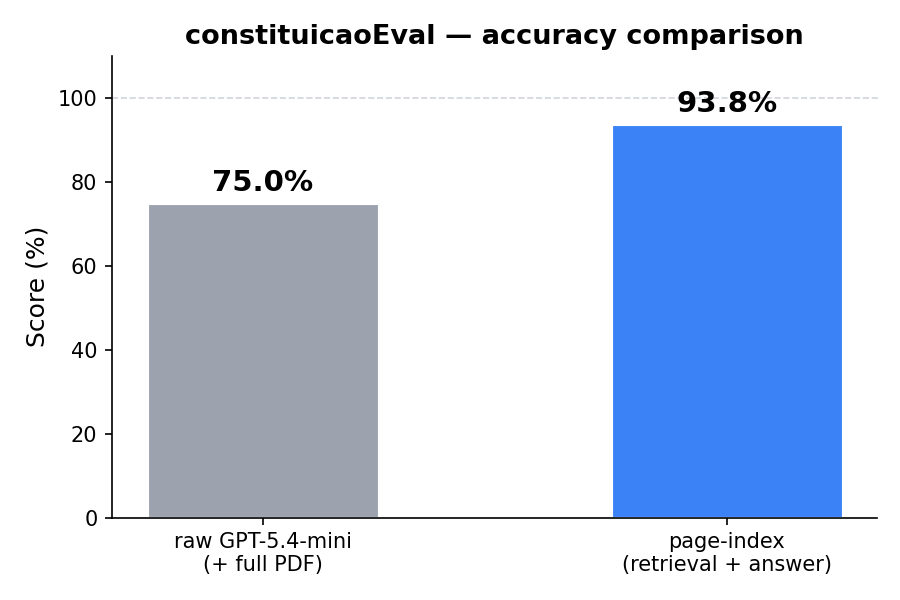

# constituicaoEval

Benchmark comparing **raw GPT-5.4-mini** (with full PDF in context) vs **page-index** (our graph-based article retrieval + GPT answer generation) on questions about the Portuguese Constitution.

## Results



| Provider | Score | Avg Latency |
|---|---|---|
| raw-gpt (GPT-5.4-mini + PDF) | 75.0% | 5.2s |
| page-index (retrieval + answer) | **93.8%** | 16.0s |

**Delta: +18.8 percentage points in favor of page-index.**

## Why page-index wins

Even when the raw model receives the full PDF and is explicitly prompted to answer *only* from the document, it still defaults to parametric knowledge on ambiguous questions — producing confident but wrong answers.

Page-index avoids this by first navigating the constitution's structure to retrieve specific articles, then generating an answer grounded exclusively in those articles. The model never sees the full document — only the relevant excerpts — which eliminates the temptation to fall back on pre-training.

## Example: "O voto é obrigatório em Portugal?"

**Raw GPT-5.4-mini** (score: 0.25) answered **"Sim"** — claiming voting is mandatory. It cited the right articles (49.º and 113.º) but misinterpreted them. Article 49.º, n.º 2 says voting is a *civic duty*, not a legal obligation, and article 113.º, n.º 2 makes *electoral registration* obligatory, not voting itself. The model confused these two concepts, likely influenced by its pre-existing knowledge that many countries do have mandatory voting.

**Page-index** (score: 1.0) correctly answered that voting is **not** legally mandatory — it is only a civic duty. It retrieved and cited both article 49.º, n.º 2 and article 113.º, n.º 2, correctly distinguishing between the obligation to register and the civic (non-binding) nature of the vote itself.

## How to run

```bash
cd benchmark
npm install

# both providers (requires API running at localhost:3088)
npm run eval

# single provider
npm run eval:raw
npm run eval:page-index

# specific questions
npx tsx src/index.ts --questions q11,q21,q14,q27

# quick smoke test (first 5 questions)
npm run eval:quick
```

Requires `AI_GATEWAY_API_KEY` in `.env`. The page-index provider needs the API server running (`cd apps/api && npm run dev`).
